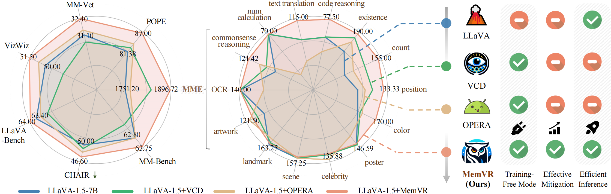
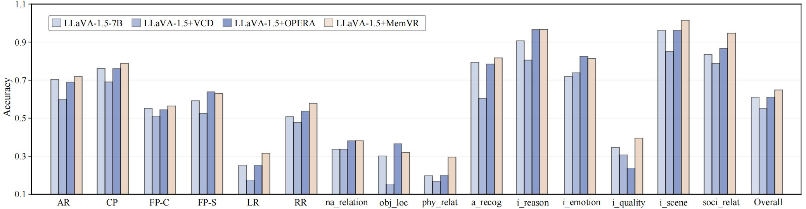
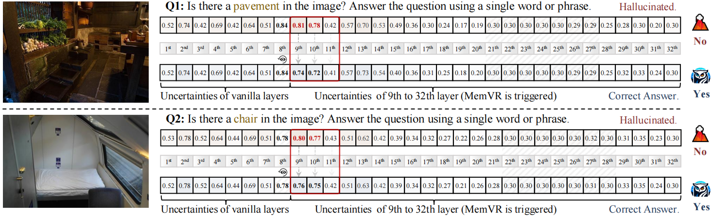
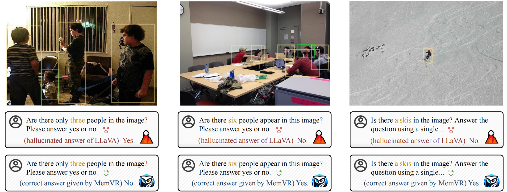
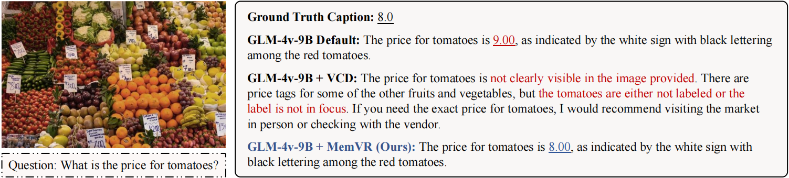

# Look Twice Before You Answer: Memory-Space Visual Retracing for Hallucination Mitigation in Multimodal Large Language Models
<!-- **Look Twice Before You Answer: Memory-Space Visual Retracing for Hallucination Mitigation in Multimodal Large Language Models** -->

  
  
  
  
  

## 🔥 Update
* [2024-10-7]: ⭐️ Paper of MemVR uploaded. Check out [this link](https://arxiv.org/abs/2410.03577) for details.
* [2024-11-14]: 🚀🚀 Codes will be released after one month.

## 🎯 Overview

<strong>It’s a game-changer for effectiveness and efficiency.</strong>strong>

In contrast to previous methods, which primarily focus on eliminating biases of language priors, MemVR seeks to replenish visual clues towards more evidential responses, which signifies the other side of the coin.
Comprehensive experimental evaluations demonstrate that MEMVR significantly mitigates hallucination issues across various MLLMs and excels in general benchmarks without incurring added time overhead.

## 🕹️ Usage

## 🏅 Experiments

*Figure 5. Results on MMBench. MemVR enhances comprehensive performance on diverse tasks.*

## 📌 Examples

*Figure 9. Visualization of uncertainty across layers without and with MemVR. MemVR effectively reduces uncertainty after the 8th layer, contributing to hallucination mitigations.*

*Figure 13: A case study comparing the levels of hallucination among various baselines.*

*Figure 10. A case study in long text generation. MemVR effectively mitigates hallucinations.*

