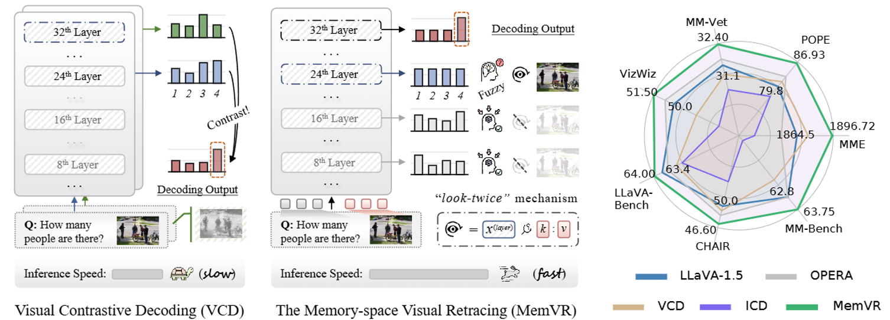
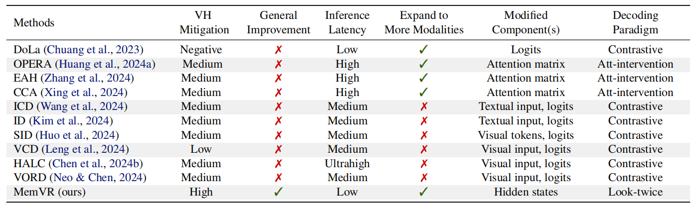
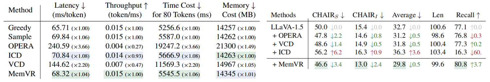

<div align=center>

</div> 
<h2 align="center">
<a href="https://arxiv.org/abs/2410.03577">Look Twice Before You Answer: Memory-Space Visual Retracing for Hallucination Mitigation in Multimodal Large Language Models
</a></h2>
    
<h5 align="center"> If you like our project, please give us a star ⭐ on GitHub for the latest update.</h5>

<h5 align=center>

[](https://arxiv.org/abs/2410.03577)
[](https://github.com/PKU-YuanGroup/Chat-UniVi/blob/main/LICENSE)    
</h5>

## 📣 News
* **[2024/10/23]**  🚀 Source code released! We're now working on extending MemVR to more MLLMs.
* **[2025/05/01]**  🎉🎉🎉 MemVR has been accepted by ICML 2025. See you in Vancouver, Canada!

## 🎯 Overview
We propose Memory-Space Visual Retracing (MemVR), a novel hallucination mitigation paradigm without needing external knowledge retrieval or additional fine-tuning. MemVR has two significant advantages:
* First, MemVR significantly mitigates hallucination issues across various MLLMs and excels in general benchmarks, emphasizing its potential for widespread applicability.
* Second, MemVR is a plug-and-play solution without incurring added time overhead.







Comprehensive experimental evaluations demonstrate that MemVR significantly mitigates hallucination issues across various MLLMs and excels in general benchmarks without incurring added time overhead. More results in the paper.

## 🕹️ Usage

### Installation

1. We recommend you use [LLaVA](https://github.com/haotian-liu/LLaVA) as the working environment. Please clone the repository from [LLaVA](https://github.com/haotian-liu/LLaVA) and set up the environment by running
```
git clone https://github.com/haotian-liu/LLaVA
cd LLaVA
conda create -n memvr python==3.10
conda activate memvr
pip install --upgrade pip
pip install -e .
```
2. After setting up, clone the repository from [MemVR](https://github.com/1zhou-Wang/MemVR) and move all contents to the main directory of LLaVA (except README.md).
```bash
LLaVA/
├── llava/
│ ├── eval/ # merge here in the next step
│ ├── .../
├── eval_scripts/
│ ├── llava/
│ ├── qwen/
│ ├── glm/
├── memvr.py/
├── inference.py/
├── images/
│ ├── ...
└── ...
```
Then merge the file [eval](https://github.com/1zhou-Wang/MemVR/tree/main/eval) to the directory 
```
/LLaVA/llava/eval/
```

### Downloading Checkpoints
Under the main directory of LLaVA:
1. Download the checkpoint of LLaVA v1.5 [here](https://huggingface.co/liuhaotian/llava-v1.5-7b).
2. Download the checkpoint of Qwen-VL-Chat [here](https://huggingface.co/Qwen/Qwen-VL-Chat). Replace the downloaded 'modeling_qwen.py' by [modeling_qwen.py](https://github.com/1zhou-Wang/MemVR/blob/main/modeling/modeling_qwen.py) to enable MemVR on Qwen-VL-Chat model.
3. Download the checkpoint of glm-4v-9b [here](https://huggingface.co/THUDM/glm-4v-9b). Replace the downloaded 'modeling_chatglm.py' by [modeling_chatglm.py](https://github.com/1zhou-Wang/MemVR/blob/main/modeling/modeling_chatglm.py) to enable MemVR on GLM-4V-9b model.

You may check if your environment works fine by running
```
python inference.py
```

### Evaluation
Follow [Evaluation.md](https://github.com/haotian-liu/LLaVA/blob/main/docs/Evaluation.md) in [LLaVA](https://github.com/haotian-liu/LLaVA) to prepare for the benchmark materials. Additionally, we recommend you use GPUs with no less than 40GB of VRAM.
Test with these benchmarks by running
```
bash eval_scripts/llava/mme.sh 
```
Please note that you may need to fill in your own OpenAI API-KEY for GPT-based evaluations like llavabench or MM-Vet.

Here are some tips of the parameters in the scripts:
```
    --retracing-ratio 0.12 \
    --entropy-threshold 0.75 \
    --starting-layer 5 \
    --ending-layer 16 \
```
Where 
* [retracing-ratio] refers to the percentage of visual_token to be retraced in a certain layer. It has a straightforward effect on the model's performance.
* [entropy-threshold] defines the minimum layer-wide entropy that triggers visual information retracing.
* [starting-layer] and [ending-layer] set the range of layers where visual information retracing is allowed.


## ✏️ Citation
If you find this paper useful, please consider staring 🌟 this repo and citing 📑 our paper:
```
@article{zou2024memvr,
  title={Look Twice Before You Answer: Memory-Space Visual Retracing for Hallucination Mitigation in Multimodal Large Language Models}, 
  author={Xin Zou and Yizhou Wang and Yibo Yan and Sirui Huang and Kening Zheng and Junkai Chen and Chang Tang and Xuming Hu},
  journal={The Forty-second International Conference on Machine Learning (ICML)},
  year={2025}
}
```
## 📝 Related Projects
- [OPERA](https://github.com/shikiw/OPERA): OPERA: Alleviating Hallucination in Multi-Modal Large Language Models via Over-Trust Penalty and Retrospection-Allocation
- [VCD](https://github.com/DAMO-NLP-SG/VCD): VCD: Mitigating Object Hallucinations in Large Vision-Language Models through Visual Contrastive Decoding
- [DoLa](https://github.com/voidism/DoLa): DoLa: Decoding by Contrasting Layers Improves Factuality in Large Language Models
- [Contrastive Decoding](https://github.com/XiangLi1999/ContrastiveDecoding): Open-ended Text Generation as Optimization
- [GLM-4V](https://github.com/THUDM/GLM-4): ChatGLM: A Family of Large Language Models from GLM-130B to GLM-4 All Tools
- [Qwen-VL](https://github.com/QwenLM/Qwen-VL): A Versatile Vision-Language Model for Understanding, Localization, Text Reading, and Beyond
- [LLaVA 1.5](https://github.com/haotian-liu/LLaVA): Improved Baselines with Visual Instruction Tuning
