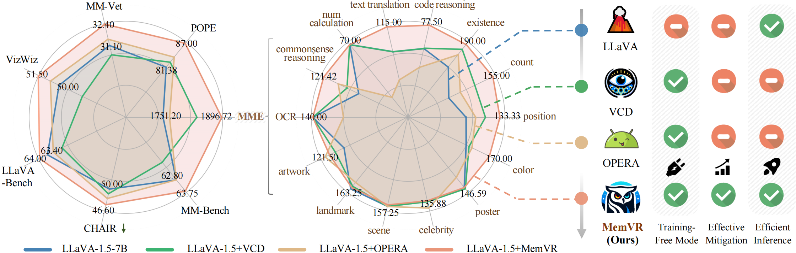
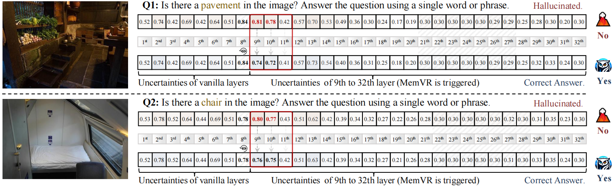
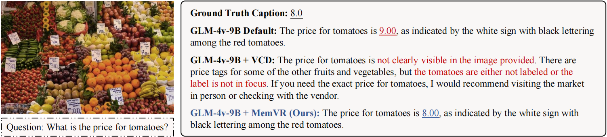

# Look Twice Before You Answer: Memory-Space Visual Retracing for Hallucination Mitigation in Multimodal Large Language Models
<!-- **Look Twice Before You Answer: Memory-Space Visual Retracing for Hallucination Mitigation in Multimodal Large Language Models** -->
This is the official implementation of MemVR!

## 🔥 Update
* [2024-10-7]: ⭐️ Paper of MemVR uploaded. Check out [this link](https://arxiv.org/pdf/2410.03577) for details.
* [2024-11-14]: 🚀🚀 Codes will be released after one month.

## 🎯 Overview

## 🕹️ Usage

## 📌 Examples

*figure 9. Visualization of uncertainty across layers without and with MemVR. MemVR effectively reduces uncertainty after the 8th layer, contributing to hallucination mitigations.*

*figure 10. A case study in long text generation. MemVR effectively mitigates hallucinations.*

